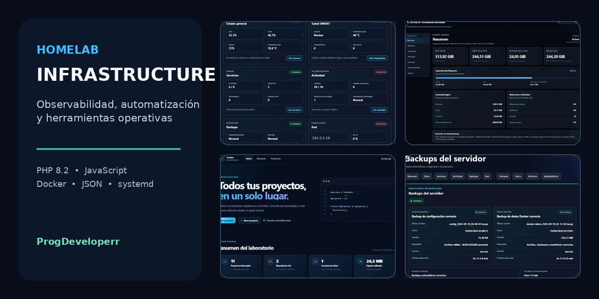
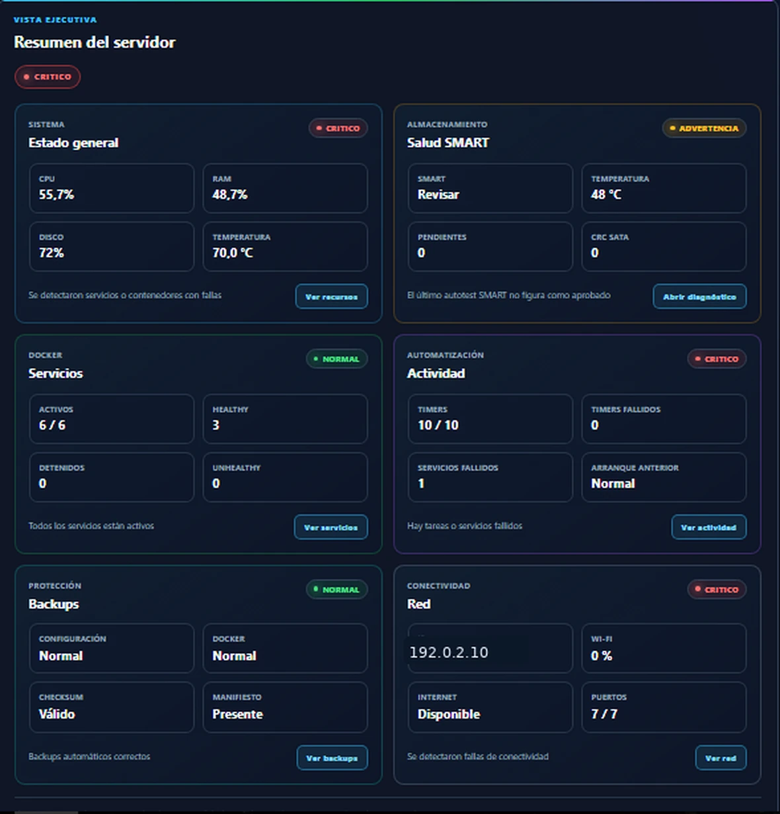
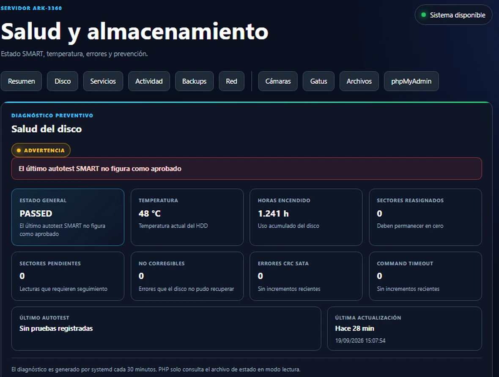
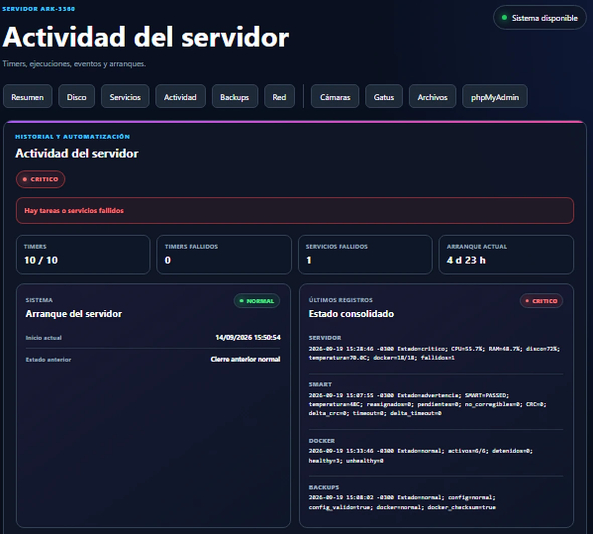
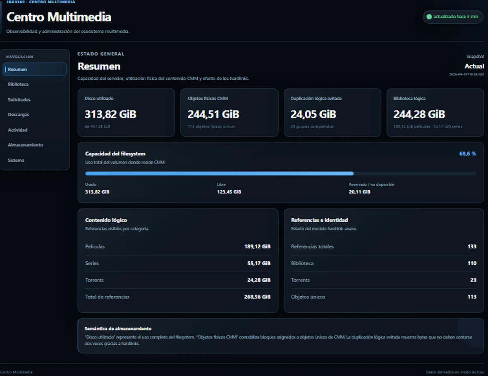
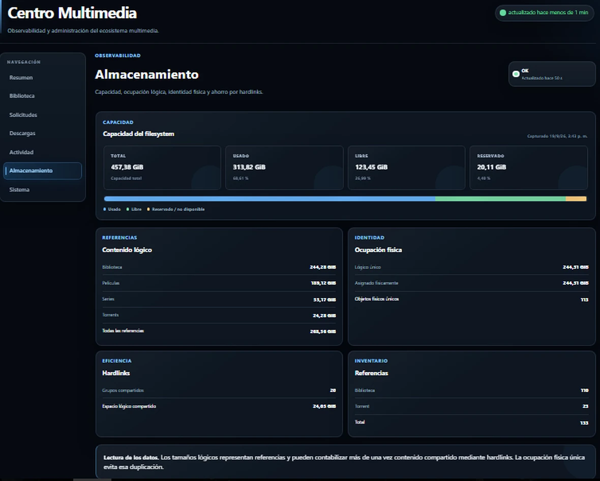
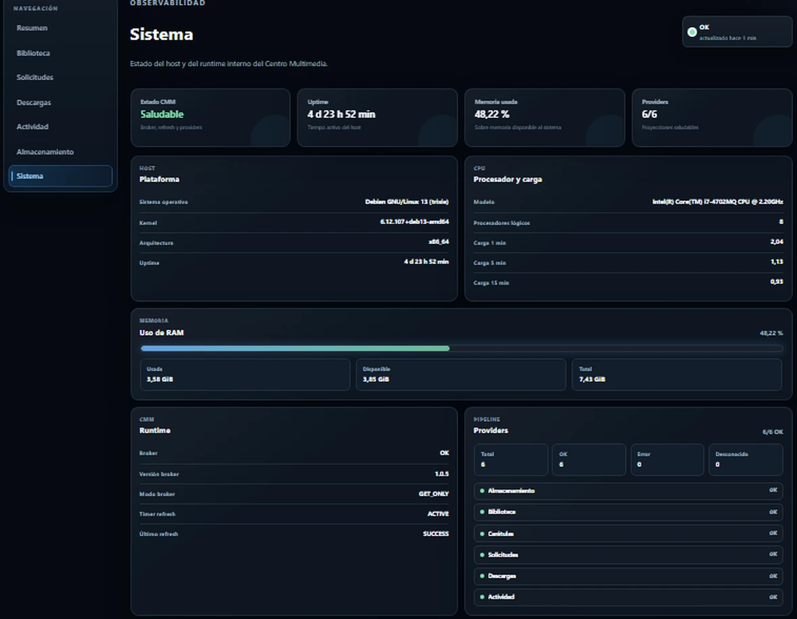
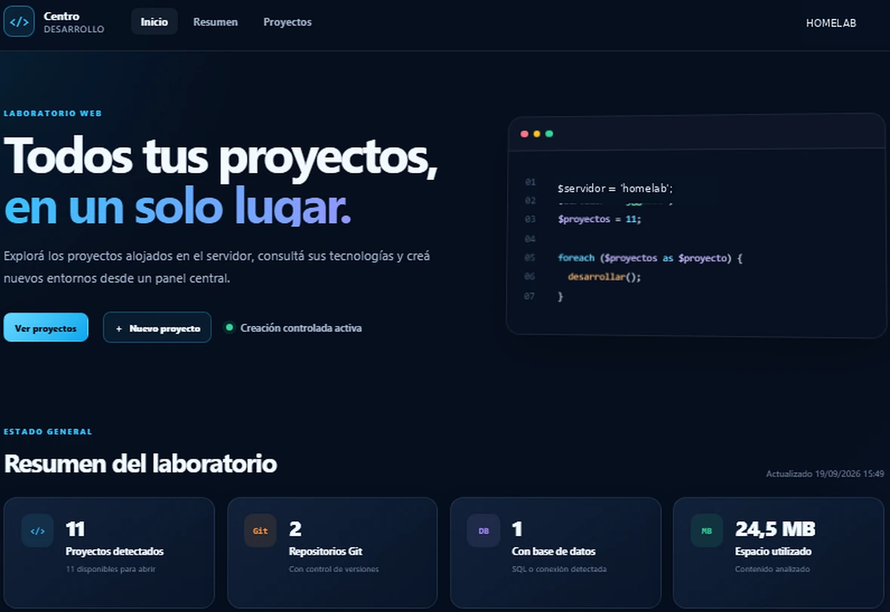
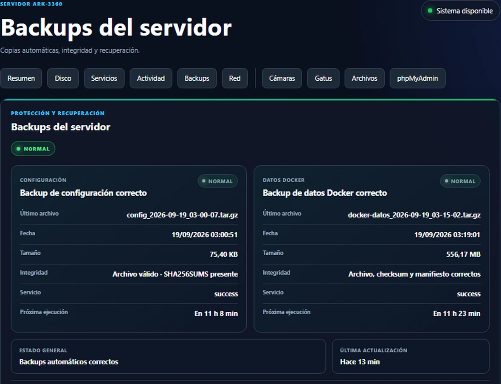
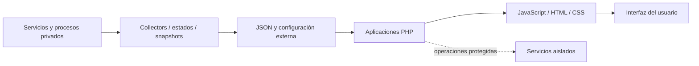

# Homelab Infrastructure

[](https://github.com/ProgDeveloperr/homelab-infrastructure/actions/workflows/php-syntax.yml)

<p align="center">
  
</p>

Colección de aplicaciones web desarrolladas para **observar, administrar y documentar un homelab real**. El repositorio reúne interfaces operativas, proyecciones de estado y herramientas de automatización construidas con una arquitectura orientada a separación de responsabilidades, mínimo privilegio y comportamiento seguro ante fallos.

El código publicado es una **versión sanitizada para portfolio**: no incluye credenciales, direcciones privadas reales, estados productivos, bases de datos, logs, sockets, respaldos ni contenido personal.

## Qué demuestra este proyecto

| Área | Implementación |
| --- | --- |
| Observabilidad | Estado de host, almacenamiento, servicios, red, tareas, backups y ecosistema multimedia |
| Backend web | PHP 8.2 con separación entre presentación, configuración y fuentes de estado |
| Frontend | JavaScript, HTML5 y CSS3 con interfaces operativas responsivas |
| Automatización | Integración con servicios systemd, timers y procesos auxiliares |
| Infraestructura | Docker, Apache, JSON, almacenamiento y servicios autoalojados |
| Seguridad | Configuración externa, publicación sanitizada, mínimo privilegio y operaciones fail-closed |
| Calidad | GitHub Actions, revisión de sintaxis, Dependabot, CODEOWNERS y plantillas de colaboración |

## Aplicaciones

| Aplicación | Propósito | Enfoque |
| --- | --- | --- |
| [Centro Servidor](apps/centro-servidor/) | Estado general del host, disco, servicios, tareas, backups y conectividad | Observabilidad operativa |
| [Centro Multimedia](apps/centro-multimedia/) | Biblioteca, solicitudes, descargas, almacenamiento y runtime multimedia | Proyecciones desacopladas y operaciones protegidas |
| [Centro Desarrollo](apps/centro-desarrollo/) | Inventario y gestión visual de proyectos alojados en el servidor | Laboratorio web y organización de proyectos |
| [Centro Backups](apps/centro-backups/) | Estado, integridad e historial de copias | Verificación y recuperación |

## Centro Servidor

Panel central para supervisar el estado del servidor, SMART, servicios, automatizaciones, copias y conectividad sin mezclar la interfaz con los procesos privilegiados que producen los datos.

<p align="center">
  
</p>

<p align="center">
  
  
</p>

## Centro Multimedia

Capa administrativa y de observabilidad del ecosistema multimedia. Modela capacidad física, referencias lógicas, biblioteca, solicitudes, descargas, actividad y salud interna mediante snapshots y providers desacoplados.

Las operaciones sensibles utilizan un plano separado de propuesta, autorización y ejecución. El diseño incorpora separación de privilegios, journaling durable y recuperación ante interrupciones; los componentes privilegiados permanecen fuera de la exportación pública.

<p align="center">
  
</p>

<p align="center">
  
  
</p>

## Centro Desarrollo

Interfaz para centralizar los proyectos alojados en el servidor, consultar tecnologías y características del entorno y mantener una vista operativa del laboratorio de desarrollo.

<p align="center">
  
</p>

## Centro Backups

Vista dedicada al estado de las copias automáticas y sus controles de integridad.

<p align="center">
  
</p>

La [galería completa](docs/SCREENSHOTS.md) contiene vistas adicionales de servicios, red, biblioteca, descargas y proyectos.

## Arquitectura



La capa web no incorpora credenciales ni necesita acceso irrestricto al sistema. Las fuentes productivas, recolectores, workers y componentes privilegiados permanecen fuera de este repositorio.

Más detalles en [docs/ARCHITECTURE.md](docs/ARCHITECTURE.md).

## Principios de diseño

- **Configuración externa:** hosts, rutas y dependencias operativas no quedan fijados en el código público.
- **Separación de responsabilidades:** la UI consume estados y APIs en lugar de sustituir servicios de sistema.
- **Mínimo privilegio:** las vistas de observabilidad priorizan lectura y exposición controlada.
- **Fail-closed:** una dependencia ausente no habilita acciones sensibles.
- **Estados desacoplados:** JSON, snapshots y proyecciones permiten desacoplar productores y consumidores.
- **Sanitización previa al versionado:** datos productivos y secretos se excluyen antes de entrar al historial Git.

## Stack

`PHP 8.2` · `JavaScript` · `HTML5` · `CSS3` · `Apache` · `Docker` · `JSON` · `systemd` · `Unix sockets`

## Estructura

```text
homelab-infrastructure/
├── apps/
│   ├── centro-backups/
│   ├── centro-desarrollo/
│   ├── centro-multimedia/
│   └── centro-servidor/
├── docs/
│   ├── ARCHITECTURE.md
│   ├── SCREENSHOTS.md
│   ├── social-preview.jpg
│   └── screenshots/
├── .github/
│   ├── ISSUE_TEMPLATE/
│   ├── workflows/
│   ├── CODEOWNERS
│   ├── dependabot.yml
│   └── pull_request_template.md
├── CONTRIBUTING.md
├── SECURITY.md
└── README.md
```

## Validación continua

GitHub Actions valida cada `push` y `pull_request` contra `main`:

- sintaxis PHP 8.2;
- sintaxis JavaScript;
- documentos JSON;
- scripts shell.

La publicación también se audita para evitar la incorporación accidental de secretos, IP privadas reales, rutas productivas y datos operativos.

## Ejecución local

Cada aplicación puede inspeccionarse de manera independiente. Por ejemplo:

```bash
cd apps/centro-servidor
php -S 127.0.0.1:8080
```

Las vistas que dependen de snapshots o servicios externos mostrarán datos vacíos o no disponibles hasta que se suministren fuentes compatibles.

## Seguridad y privacidad

No se versionan:

- contraseñas, tokens, claves privadas ni credenciales;
- direcciones IP privadas reales;
- rutas internas del servidor original;
- bases de datos o estados productivos;
- logs, sockets o archivos temporales;
- backups y contenido multimedia real.

Consulte [SECURITY.md](SECURITY.md) antes de reportar información potencialmente sensible.

## Estado

Proyecto personal activo y utilizado como laboratorio práctico de desarrollo web, observabilidad, automatización e infraestructura autoalojada.

Desarrollado por [ProgDeveloperr](https://github.com/ProgDeveloperr).
