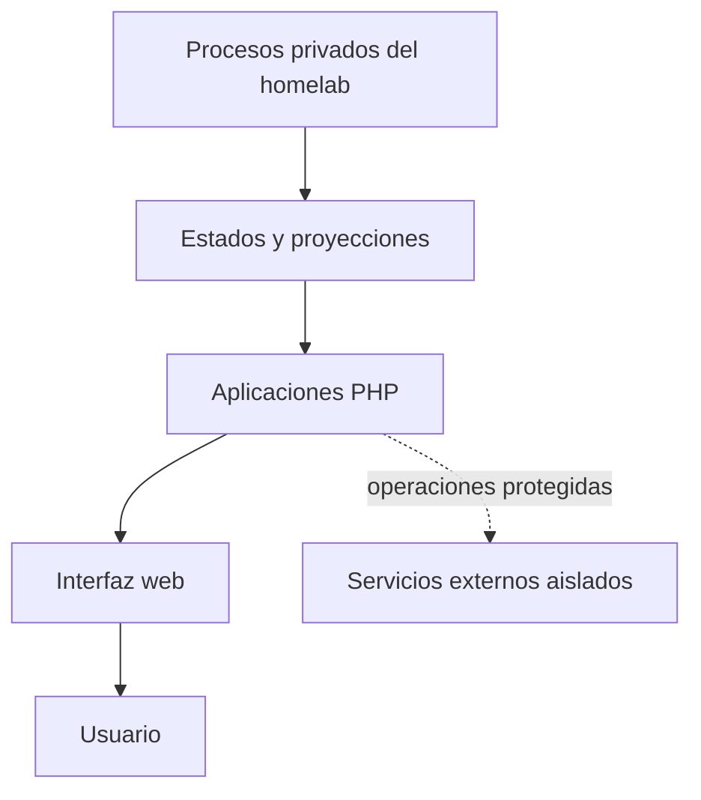

# Homelab Infrastructure

Colección sanitizada de aplicaciones web desarrolladas para observar y administrar un laboratorio doméstico. El repositorio reúne cuatro módulos independientes construidos con PHP, JavaScript, HTML y CSS, con especial atención a la configuración externa, la separación de responsabilidades y el comportamiento seguro ante fallos.

Esta publicación presenta el diseño y el código de las interfaces sin exponer credenciales, datos operativos, direcciones privadas, rutas productivas ni contenido personal del servidor.

## Módulos

| Aplicación | Propósito | Enfoque principal |
| --- | --- | --- |
| [Centro Desarrollo](apps/centro-desarrollo/) | Organizar y consultar proyectos alojados en un servidor web | Gestión centralizada y configuración externa |
| [Centro Servidor](apps/centro-servidor/) | Presentar estado de servicios, red, almacenamiento, backups y eventos | Observabilidad de solo lectura |
| [Centro Multimedia](apps/centro-multimedia/) | Consultar biblioteca, solicitudes, descargas y estado multimedia | Proyecciones JSON y operaciones sensibles *fail-closed* |
| [Centro Backups](apps/centro-backups/) | Visualizar historial e integridad de respaldos | Lectura segura y comprobaciones SHA-256 |

Cada módulo incluye su propio `README.md` y `.env.example` con requisitos, variables y límites específicos.

## Arquitectura general



Las aplicaciones públicas funcionan como capa de presentación. La recolección de datos, las credenciales, los servicios privilegiados y los archivos productivos permanecen fuera del repositorio.

La descripción completa se encuentra en [docs/ARCHITECTURE.md](docs/ARCHITECTURE.md).

## Principios del proyecto

- **Configuración externa:** rutas y hosts dependen de variables de entorno.
- **Datos fuera del código:** los estados productivos no se versionan.
- **Mínimo privilegio:** las vistas de observabilidad operan en modo lectura.
- **Fail-closed:** una dependencia ausente no habilita acciones sensibles.
- **Separación de responsabilidades:** la interfaz no reemplaza recolectores, workers ni autorizadores.
- **Publicación sanitizada:** el código se revisa antes de incorporarse al historial Git.

## Tecnologías

- PHP 8.2
- JavaScript
- HTML5 y CSS3
- Apache HTTP Server
- JSON como formato de proyección
- Docker como entorno de ejecución opcional
- Sockets Unix para integraciones aisladas

## Estructura del repositorio

```text
homelab-infrastructure/
├── apps/
│   ├── centro-backups/
│   ├── centro-desarrollo/
│   ├── centro-multimedia/
│   └── centro-servidor/
├── docs/
│   └── ARCHITECTURE.md
├── .gitattributes
├── .gitignore
├── README.md
└── SECURITY.md
```

Los directorios reservados para infraestructura, diagramas, capturas o scripts solo se incorporarán cuando exista contenido público real. Git no versiona carpetas vacías.

## Ejecución local

Cada aplicación puede revisarse de forma independiente. Por ejemplo:

```bash
cd apps/centro-servidor
php -S 127.0.0.1:8080
```

Luego abra `http://127.0.0.1:8080` en el navegador.

Las aplicaciones que consumen estados externos mostrarán información vacía o no disponible hasta que se configuren fuentes compatibles.

## Configuración

Los archivos `.env.example` documentan las variables admitidas. PHP no los carga automáticamente: las variables deben suministrarse mediante Apache, PHP-FPM, Docker o el gestor de procesos utilizado.

Nunca deben versionarse archivos `.env` reales ni reemplazarse los valores de ejemplo por información productiva.

## Validación

Para comprobar la sintaxis de todos los archivos PHP:

```bash
find apps -type f -name '*.php' -print0 \
  | xargs -0 -n1 php -l
```

La preparación inicial de esta publicación validó 64 archivos PHP y auditó el staging para detectar secretos, rutas productivas, sockets, bases de datos, copias históricas y archivos de estado.

## Alcance público

El repositorio incluye código de interfaz y ejemplos de configuración. No incluye:

- credenciales, tokens o claves privadas;
- estados JSON productivos;
- bases de datos, registros o archivos temporales;
- contenido multimedia o respaldos reales;
- sockets y servicios privilegiados;
- configuración interna completa del servidor;
- proyectos personales clasificados como privados.

Consulte [SECURITY.md](SECURITY.md) antes de reportar una vulnerabilidad o publicar información potencialmente sensible.

## Estado

Proyecto personal en evolución. Su objetivo es documentar experiencia práctica en desarrollo web, observabilidad, automatización y diseño seguro de herramientas para infraestructura doméstica.

Desarrollado por [ProgDeveloperr](https://github.com/ProgDeveloperr).
