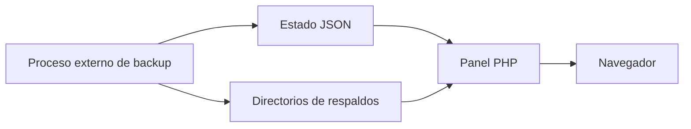

# Centro Backups

Panel web de solo lectura para consultar el estado, historial e integridad de respaldos de un homelab. Forma parte de **Homelab Infrastructure** y mantiene separadas la generación de backups y su visualización.

El repositorio público contiene únicamente la interfaz. No incluye copias de seguridad, estados operativos reales, credenciales, bases de datos ni rutas del servidor productivo.

## Objetivo

Ofrecer una vista simple y centralizada del sistema de respaldos sin conceder al proceso web permisos para crear, modificar o eliminar archivos.

La aplicación consume un estado JSON generado externamente y examina directorios configurados para presentar información de respaldos de proyectos y bases de datos.

## Funcionalidades

- Resumen del estado general de los backups.
- Historial de respaldos de proyectos y MariaDB.
- Visualización de nombre, tipo, tamaño y fecha de cada archivo.
- Comprobación de archivos de checksum SHA-256 asociados.
- Ordenamiento del historial por fecha de modificación.
- Formateo legible de fechas y tamaños.
- Estados seguros cuando una fuente no existe o no puede leerse.
- Interfaz adaptable construida sin frameworks de frontend.

## Arquitectura



Centro Backups no ejecuta el proceso de respaldo. Su responsabilidad es exclusivamente presentar información producida por herramientas externas.

## Seguridad por diseño

- **Solo lectura:** no contiene llamadas para escribir, mover o eliminar archivos.
- **Sin ejecución de comandos:** la aplicación no invoca shell, Docker ni servicios del sistema.
- **Rutas configurables:** los orígenes se reciben mediante variables de entorno.
- **Alcance limitado:** el historial examina únicamente las categorías previstas por la aplicación.
- **Integridad visible:** cada respaldo puede acompañarse de un archivo `.sha256`.
- **Sin datos productivos:** el JSON real y los archivos respaldados están excluidos del repositorio.
- **Degradación segura:** una fuente ausente produce un estado vacío en lugar de habilitar comportamientos alternativos.

## Tecnologías

- PHP 8.2
- HTML5
- CSS3
- JavaScript
- JSON
- Apache HTTP Server

## Estructura

```text
centro-backups/
├── recursos/
│   ├── css/
│   │   └── estilos.css
│   └── js/
│       └── app.js
├── .env.example
├── index.php
└── README.md
```

## Configuración

Las variables deben ser suministradas por Apache, PHP-FPM, Docker o el gestor de procesos utilizado. El proyecto no carga automáticamente archivos `.env`.

| Variable | Finalidad | Valor público predeterminado |
| --- | --- | --- |
| `HOMELAB_BACKUPS_STATUS_FILE` | Archivo JSON con el estado general | `/var/lib/homelab/state/backups.json` |
| `HOMELAB_BACKUPS_DIR` | Directorio raíz del historial de respaldos | `/var/lib/homelab/backups` |

`.env.example` funciona como inventario de configuración y no debe reemplazarse por un archivo que contenga rutas o valores productivos.

## Organización esperada

El directorio configurado en `HOMELAB_BACKUPS_DIR` puede utilizar la siguiente estructura:

```text
backups/
├── proyectos/
│   ├── ejemplo.tar.gz
│   └── ejemplo.tar.gz.sha256
└── sql/
    ├── ejemplo.sql.gz
    └── ejemplo.sql.gz.sha256
```

Los nombres son ilustrativos. Los archivos reales no deben incorporarse al repositorio.

## Ejecución local

Requisitos mínimos:

- PHP 8.2 o compatible.
- Permisos de lectura sobre el estado y los directorios configurados.

Para revisar la interfaz con el servidor de desarrollo de PHP:

```bash
php -S 127.0.0.1:8080
```

Luego abra `http://127.0.0.1:8080` en el navegador. Sin fuentes configuradas, el panel debe conservar un comportamiento seguro y mostrar información vacía o no disponible.

## Validación

La sintaxis PHP puede comprobarse con:

```bash
php -l index.php
```

Antes de publicar cambios también se recomienda verificar que:

- no exista un archivo `.env` real;
- no se versionen respaldos ni estados JSON productivos;
- no aparezcan rutas, hostnames o direcciones del entorno real;
- no se incorporen archivos de base de datos, registros o claves privadas;
- el proceso web continúe operando únicamente en modo lectura.

## Alcance del repositorio público

Este módulo demuestra una separación clara entre la generación de respaldos y su observabilidad. Los scripts de backup, credenciales, destinos, políticas de retención y datos operativos pertenecen a la infraestructura privada y no forman parte de esta publicación.

## Estado

Proyecto personal en evolución, desarrollado como parte de un laboratorio doméstico orientado a observabilidad, automatización y administración segura.
