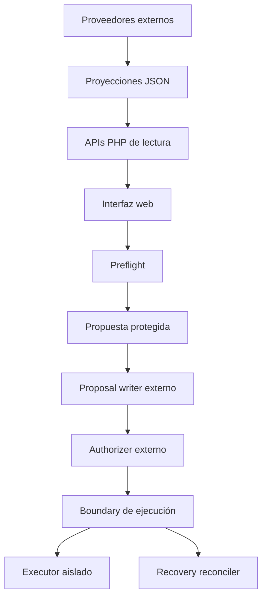

# Centro Multimedia

Panel web para consultar y administrar de forma controlada el estado de una biblioteca multimedia doméstica. Forma parte de **Homelab Infrastructure** y separa la interfaz pública, las proyecciones de solo lectura y las operaciones sensibles.

El repositorio contiene únicamente el código de presentación y las APIs web. No incluye datos productivos, credenciales, bases de datos, sockets de ejecución ni archivos multimedia.

## Objetivo

Centralizar en una interfaz web la información necesaria para observar una plataforma multimedia: biblioteca, descargas, solicitudes, almacenamiento, actividad y estado general del sistema.

Las operaciones potencialmente destructivas siguen un flujo independiente, validado y *fail-closed*. La aplicación web no elimina archivos directamente.

## Funcionalidades

- Resumen del estado general de la plataforma.
- Consulta de biblioteca multimedia y disponibilidad de elementos.
- Seguimiento de solicitudes y descargas.
- Visualización de almacenamiento y actividad reciente.
- Entrega controlada de carátulas mediante manifiesto.
- APIs JSON con validación de método y estructura.
- Preflight previo a operaciones sensibles.
- Creación opcional de propuestas mediante un componente externo.
- Validaciones de origen, sesión y token CSRF.
- Valores seguros cuando una fuente de datos no está disponible.

## Arquitectura



La interfaz consume proyecciones JSON generadas fuera de este proyecto. Las solicitudes sensibles atraviesan validaciones web y, cuando están habilitadas, se delegan mediante sockets Unix a servicios externos responsables de autorizar y registrar la operación.

## Seguridad por diseño

- **Solo lectura por defecto:** las vistas principales consumen archivos de estado sin modificarlos.
- **Fail-closed:** `CMM_PROPOSAL_CREATE_ENABLED` está desactivado de manera predeterminada.
- **Sin mutación directa:** el frontend y las APIs públicas no ejecutan eliminaciones sobre la biblioteca.
- **Separación de privilegios:** writer, authorizer y plano de ejecución son componentes externos comunicados mediante sockets Unix.
- **Boundary de ejecución:** la aplicación web no posee directamente la primitiva de eliminación sobre el filesystem.
- **Registro durable:** las operaciones sensibles preservan evidencia persistente de sus transiciones antes y después del punto irreversible.
- **Recuperación fail-closed:** el recovery utiliza evidencia durable y no interpreta por sí sola la ausencia de un archivo como éxito.
- **Protección web:** las propuestas aplican controles de sesión, CSRF, mismo origen y estructura exacta de la solicitud.
- **Rutas protegidas:** una lista configurable impide aceptar destinos pertenecientes a directorios sensibles.
- **Datos privados excluidos:** el repositorio no contiene estados reales, archivos multimedia, secretos ni información del servidor productivo.

## Tecnologías

- PHP 8.2
- JavaScript
- HTML5
- CSS3
- JSON
- Apache HTTP Server
- Sockets Unix para integración con servicios externos

## Estructura

```text
centro-multimedia/
├── api/                 # Endpoints JSON y preflight de acciones
├── includes/            # Lectura, validación y lógica compartida
├── recursos/
│   ├── css/             # Estilos de la interfaz
│   └── js/              # Comportamiento de cada módulo
├── vistas/              # Secciones visuales del panel
├── .env.example         # Variables públicas de referencia
└── index.php            # Punto de entrada de la aplicación
```

## Configuración

Las variables deben ser suministradas por Apache, PHP-FPM, Docker o el gestor de procesos utilizado. El proyecto no carga automáticamente archivos `.env`.

| Variable | Finalidad | Valor público predeterminado |
| --- | --- | --- |
| `CMM_STATE_DIR` | Directorio de proyecciones JSON | `/var/lib/cmm/state` |
| `CMM_POSTER_ROOT` | Directorio de carátulas y manifiesto | `/var/lib/cmm/posters` |
| `CMM_LIBRARY_URL` | Endpoint interno de biblioteca | `http://127.0.0.1/centro-multimedia/api/biblioteca.php` |
| `CMM_WRITER_SOCKET` | Socket del registrador externo | `/run/cmm/cmm-action-writer.sock` |
| `CMM_AUTHORIZER_SOCKET` | Socket del autorizador externo | `/run/cmm/cmm-delete-authorizer.sock` |
| `CMM_PROPOSAL_CREATE_ENABLED` | Habilita la creación de propuestas | `false` |
| `CMM_PROTECTED_PREFIXES` | Prefijos que nunca pueden utilizarse como destino | `/etc/,/home/,/root/,/run/,/var/lib/,/srv/private/` |

Puede utilizarse `.env.example` como inventario de configuración, sin copiar secretos ni valores productivos al repositorio.

## Ejecución local

Requisitos mínimos:

- PHP 8.2 o compatible.
- Apache con soporte para PHP, o el servidor de desarrollo de PHP.
- Permisos de lectura sobre los directorios configurados.

Para una revisión local de la interfaz:

```bash
php -S 127.0.0.1:8080
```

Luego abra `http://127.0.0.1:8080` en el navegador. Si las proyecciones no están presentes, las vistas deben conservar un comportamiento seguro y mostrar estados no disponibles.

## Validación

La sintaxis de todos los archivos PHP puede comprobarse con:

```bash
find . -type f -name '*.php' -print0 \
  | xargs -0 -n1 php -l
```

Antes de publicar una modificación también se recomienda verificar que:

- no existan archivos `.env` reales;
- no se incorporen JSON productivos ni bases de datos;
- no se versionen sockets, registros o copias de respaldo;
- la creación de propuestas continúe desactivada por defecto;
- las rutas y direcciones del entorno real no aparezcan en el historial Git.

## Alcance del repositorio público

Este código permite estudiar la interfaz, las APIs y los límites de seguridad del proyecto. Para ejecutar el flujo completo se necesitan servicios externos compatibles de writer, authorizer, ejecución y recuperación, además de las proyecciones de estado generadas por la infraestructura privada.

Los componentes privilegiados, la evidencia de ejecución y los datos operativos no forman parte de esta publicación.

## Flujo de operaciones protegidas

El flujo productivo fue validado de extremo a extremo con preflight, propuesta, autorización, separación de privilegios, ejecución controlada, journaling durable, recuperación ante interrupciones y convergencia posterior del inventario.

La aplicación web no ejecuta directamente la operación irreversible. Los componentes privilegiados y la evidencia operativa permanecen fuera de esta publicación.

## Estado

Proyecto personal en evolución, desarrollado como parte de un laboratorio doméstico orientado a observabilidad, automatización y diseño seguro de operaciones.
