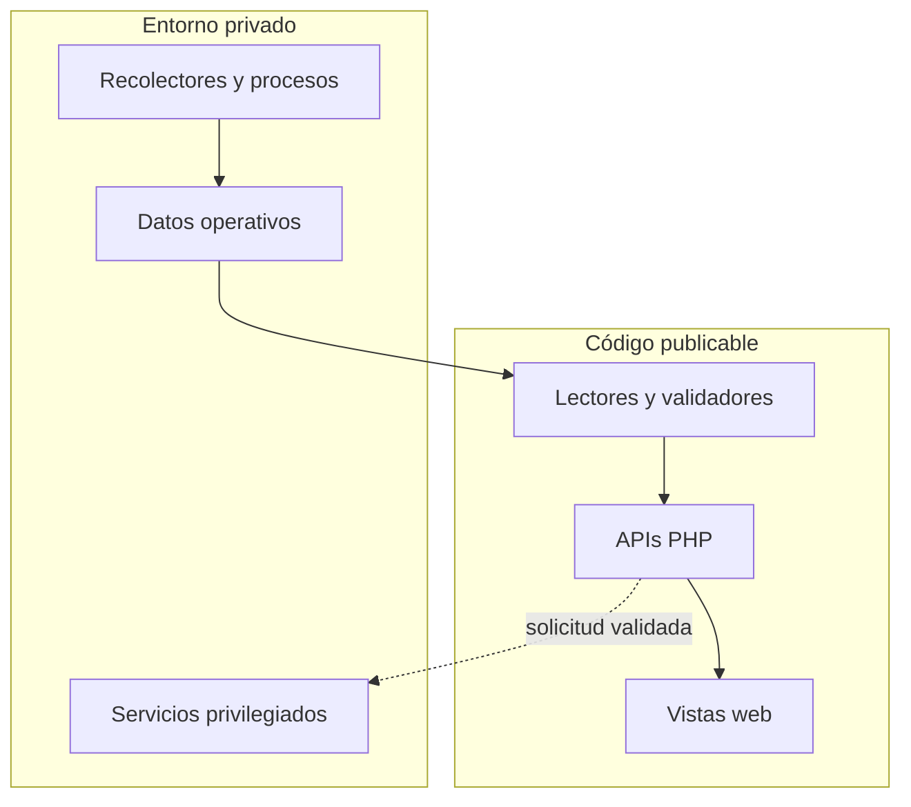

# Arquitectura

## Visión general

Homelab Infrastructure agrupa aplicaciones web que presentan información generada por procesos externos. El repositorio público representa la capa de interfaz y sus límites de seguridad; la infraestructura productiva permanece separada.

## Capas

### 1. Producción privada

Contiene recolectores, workers, temporizadores, credenciales, bases de datos, contenido personal y configuraciones específicas del servidor. Ningún elemento de esta capa debe incorporarse al repositorio público sin una revisión independiente.

### 2. Estados y proyecciones

Los procesos externos transforman información operativa en archivos JSON acotados. Las aplicaciones web consumen esas proyecciones mediante rutas configurables y valores predeterminados no productivos.

### 3. Aplicaciones web

Los módulos PHP validan y presentan la información. Cuando una fuente no existe, no puede leerse o contiene datos inválidos, la respuesta esperada es un estado vacío o no disponible.

### 4. Operaciones sensibles

Centro Multimedia incluye una frontera adicional para propuestas de acciones. La interfaz realiza controles de sesión, CSRF, mismo origen y estructura antes de comunicarse con servicios externos mediante sockets Unix.

La creación de propuestas está desactivada por defecto. La mutación final no pertenece a la aplicación web pública.

## Módulos y responsabilidades

| Módulo | Entrada principal | Responsabilidad | Fuera de alcance |
| --- | --- | --- | --- |
| Centro Desarrollo | Directorio de proyectos y estado configurable | Navegación y gestión visual de proyectos | Configuración productiva del servidor |
| Centro Servidor | Estados JSON generados externamente | Observabilidad de sistema y servicios | Recolección y administración privilegiada |
| Centro Multimedia | Proyecciones JSON, carátulas y servicios aislados | Consulta multimedia y preflight protegido | Datos multimedia y ejecución privilegiada |
| Centro Backups | Estado JSON y directorios configurados | Historial e integridad de respaldos | Creación, retención y almacenamiento real |

## Límites de confianza

### Entrada HTTP

Toda entrada proveniente del navegador se considera no confiable. Las rutas sensibles deben validar método, sesión, origen, token CSRF, claves exactas y tipos antes de continuar.

### Archivos de estado

Aunque sean generados internamente, los JSON pueden estar incompletos, desactualizados o dañados. Los lectores verifican disponibilidad y estructura antes de exponer datos.

### Sistema de archivos

Las aplicaciones públicas no deben recibir rutas productivas codificadas. Los directorios se configuran por entorno y las rutas protegidas se rechazan de forma explícita.

### Servicios externos

Writer y authorizer constituyen fronteras de privilegio independientes. La disponibilidad de una interfaz no implica autorización para ejecutar una acción.

## Configuración

| Área | Variables principales |
| --- | --- |
| Desarrollo | `HOMELAB_PROJECTS_PATH`, `HOMELAB_STATUS_FILE`, `HOMELAB_SERVER_HOST` |
| Servidor | `HOMELAB_STATE_DIR`, `HOMELAB_SERVER_HOST` |
| Multimedia | `CMM_STATE_DIR`, `CMM_POSTER_ROOT`, `CMM_LIBRARY_URL`, `CMM_WRITER_SOCKET`, `CMM_AUTHORIZER_SOCKET`, `CMM_PROPOSAL_CREATE_ENABLED`, `CMM_PROTECTED_PREFIXES` |
| Backups | `HOMELAB_BACKUPS_STATUS_FILE`, `HOMELAB_BACKUPS_DIR` |

Los valores concretos del entorno deben administrarse fuera de Git.

## Propiedades de seguridad

- Los secretos no forman parte del código ni de los ejemplos.
- Las rutas productivas se sustituyen por variables de entorno.
- Los módulos de observabilidad conservan acceso de solo lectura.
- Los datos ausentes producen degradación segura.
- Las operaciones sensibles comienzan deshabilitadas.
- Los componentes privilegiados permanecen fuera del proceso web.
- Los archivos temporales, históricos y operativos están excluidos por `.gitignore`.

## Publicación

El flujo recomendado antes de publicar es:

1. Copiar únicamente código seleccionado a un staging aislado.
2. Excluir estados, bases, logs, sockets y respaldos.
3. Parametrizar rutas y hosts.
4. validar la sintaxis PHP.
5. Ejecutar una auditoría de secretos e identificadores.
6. Revisar los archivos que Git incorporará.
7. Crear primero un repositorio remoto privado.
8. Cambiar la visibilidad solo después de revisar el contenido remoto.

La copia pública nunca debe utilizarse como reemplazo directo de la configuración productiva.
