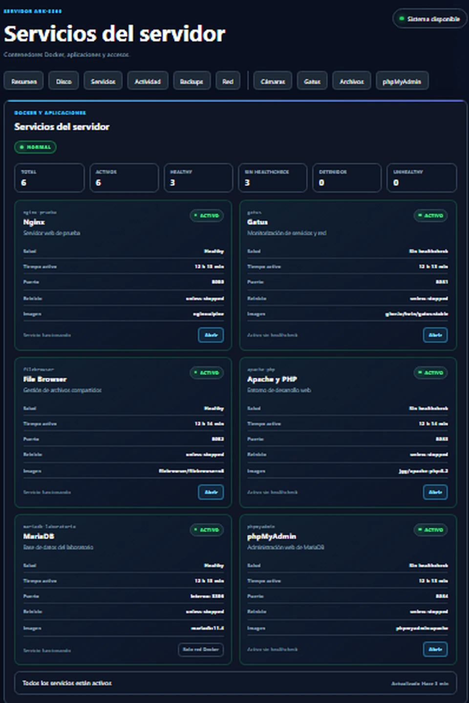
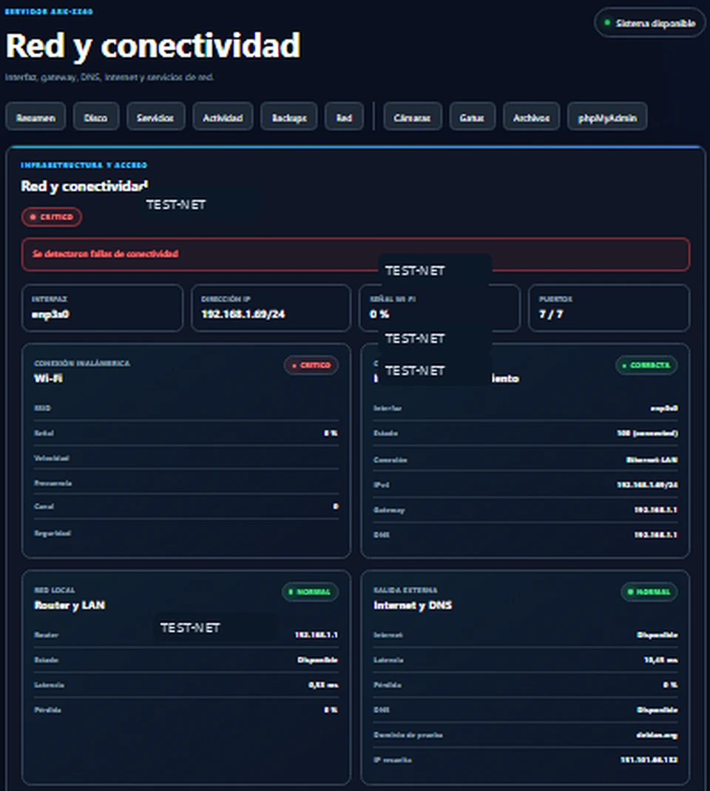
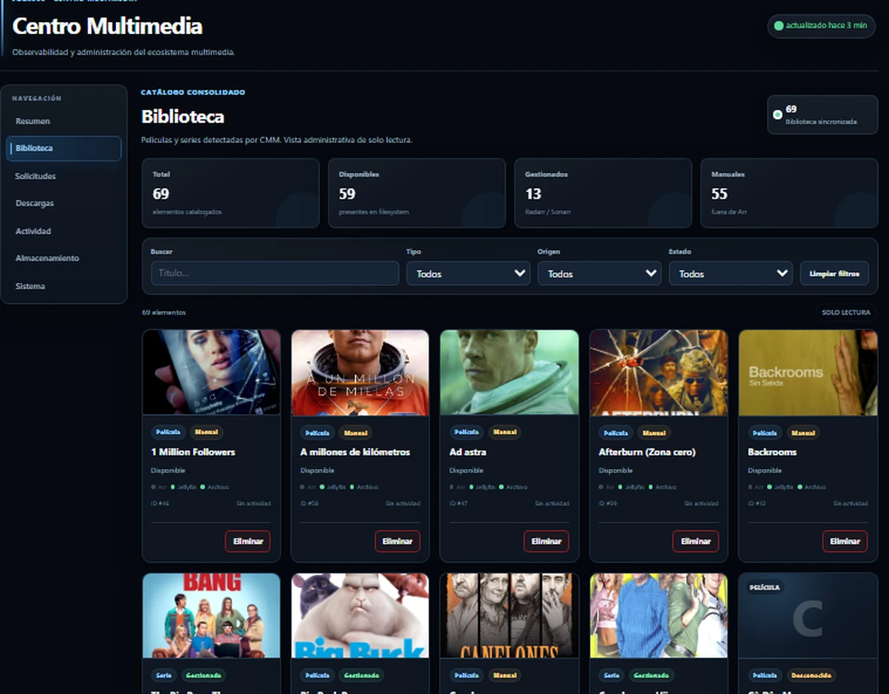
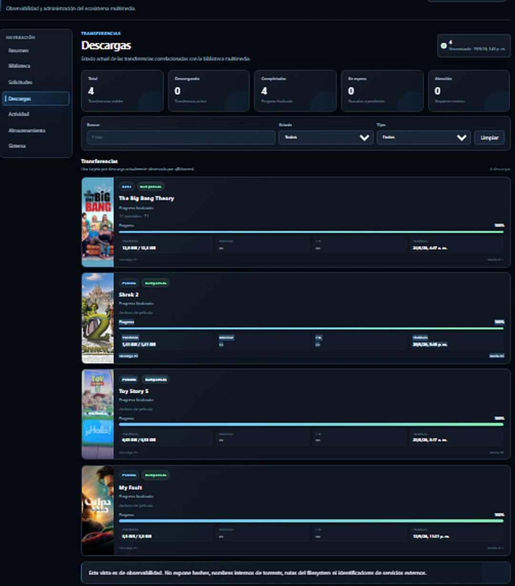
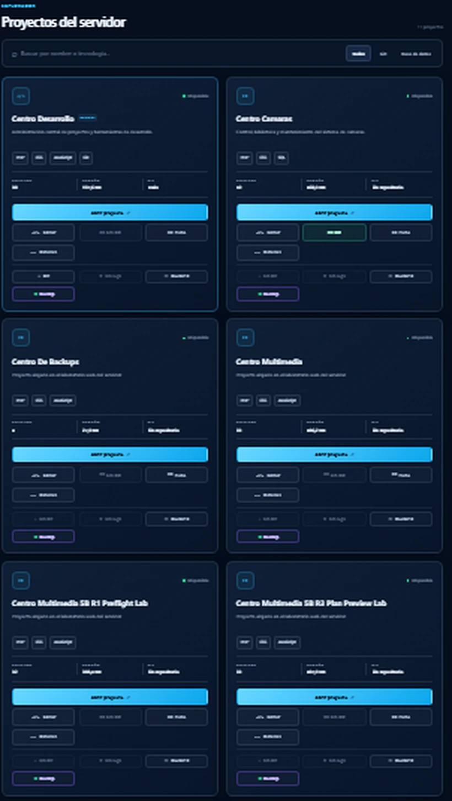

# Galería

Capturas sanitizadas del entorno real utilizado para desarrollar y validar las aplicaciones de este repositorio.

## Centro Servidor

### Resumen operativo

### Salud y almacenamiento

### Servicios

### Actividad y automatización

### Red y conectividad

Las direcciones privadas visibles en la captura original fueron sustituidas por valores de documentación.

## Centro Multimedia

### Resumen

### Biblioteca

### Descargas

### Almacenamiento

### Sistema y providers

## Centro Desarrollo

### Inicio

### Proyectos

## Centro Backups

### Estado de copias

